# Early-Warning-System-Geofencing-
AlertZW is an Early Warning Broadcasting and Notification System that allows citizens to report natural disasters and disease outbreaks in order for travelling citizens to exercise necessary caution when entering affected geofences.

## Screenshots
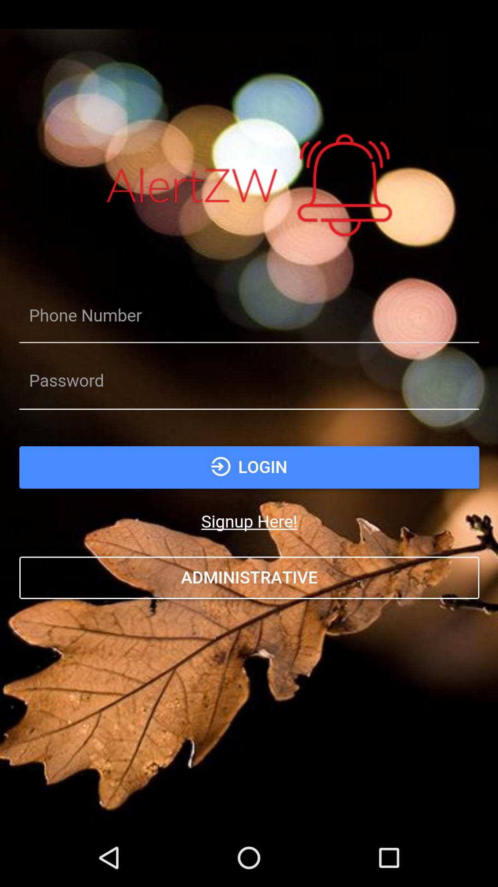
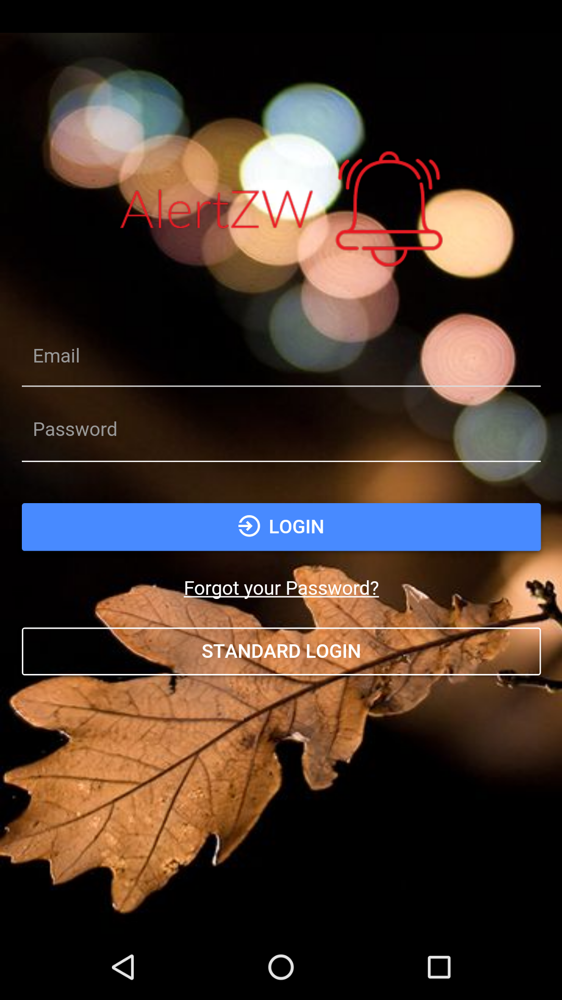
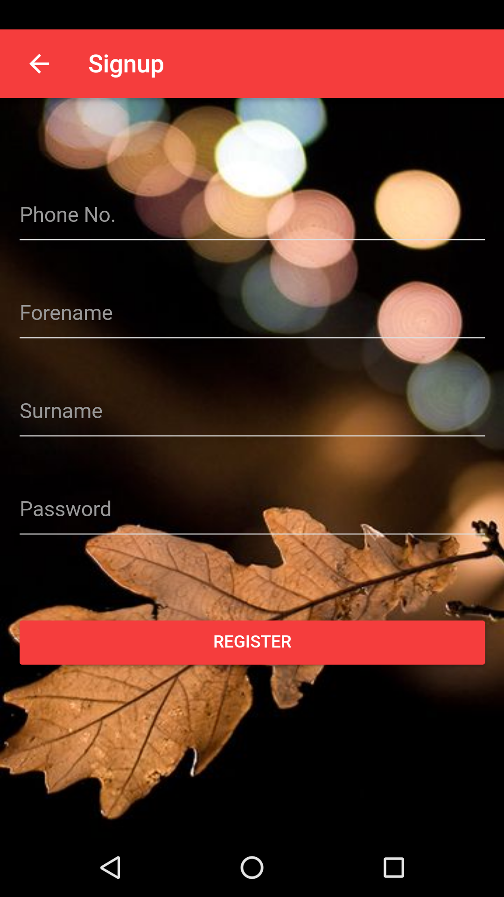
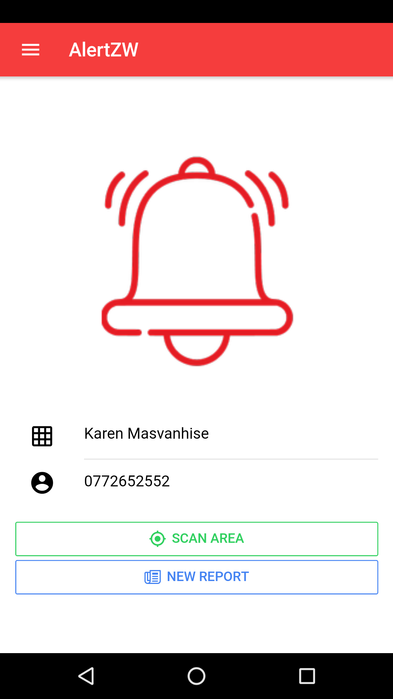
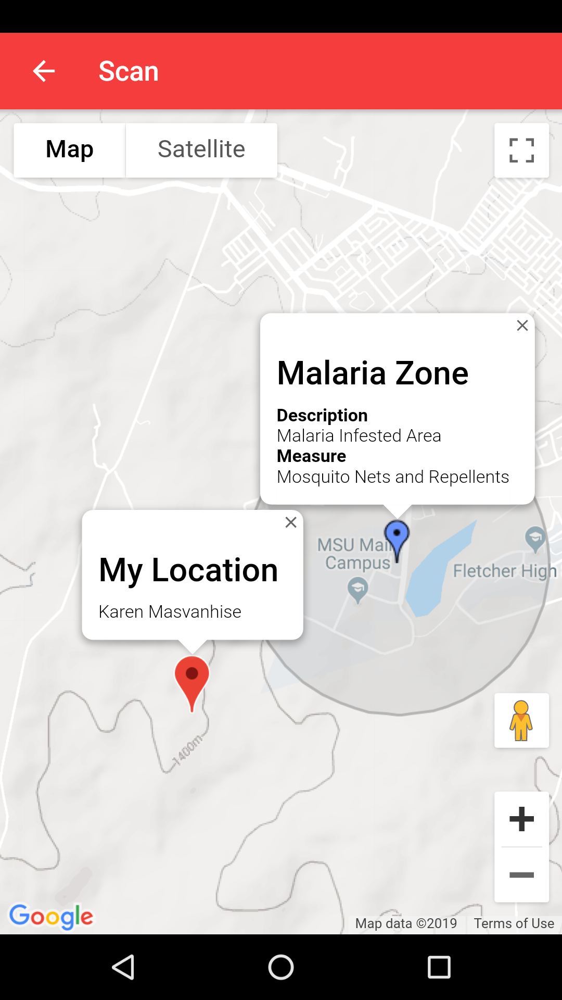
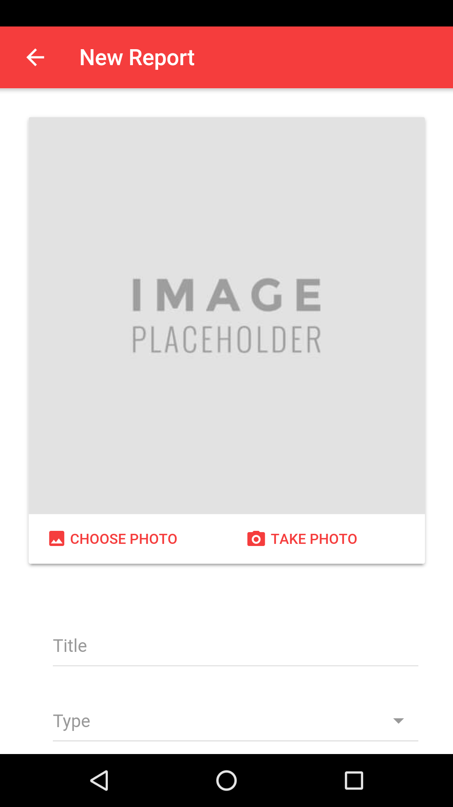
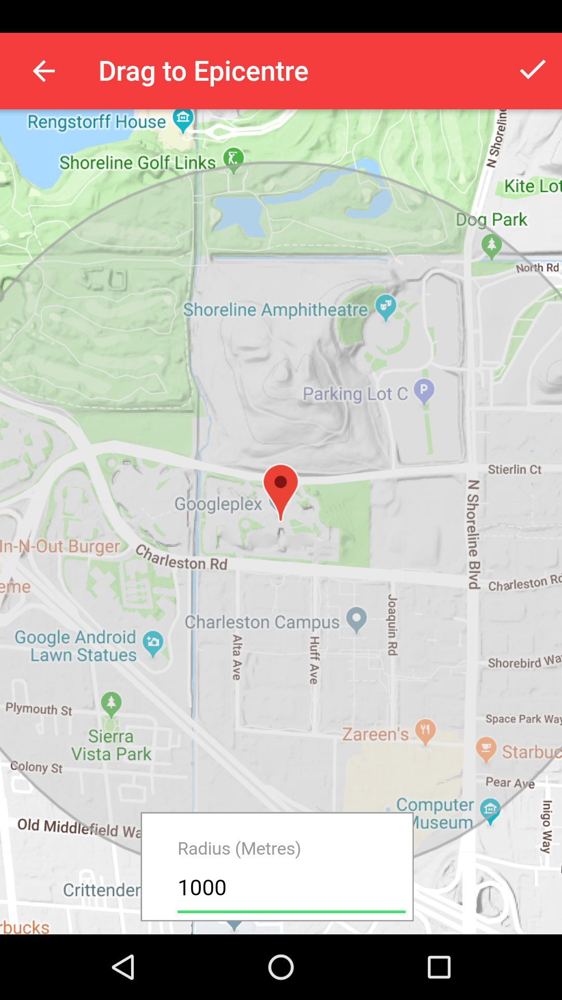
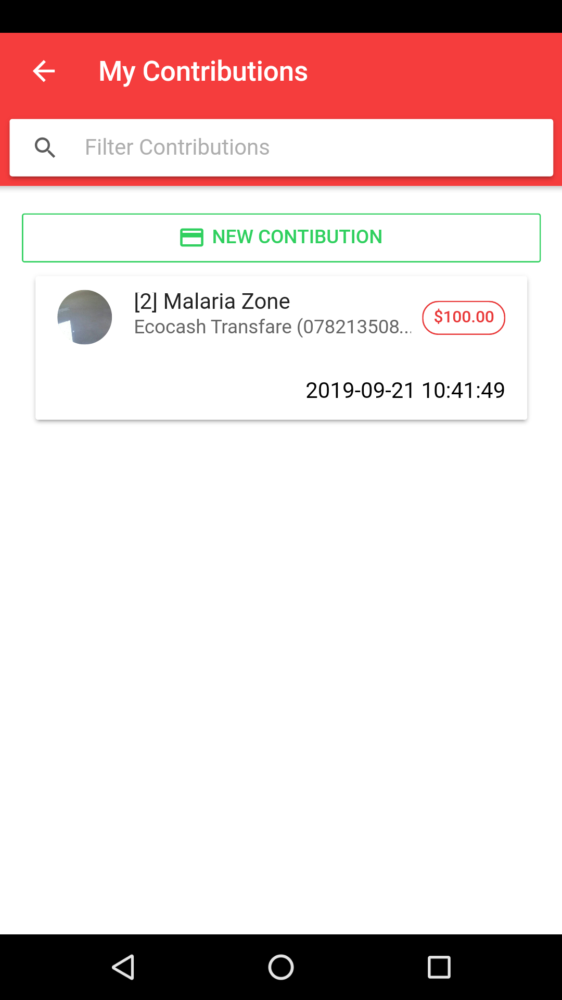
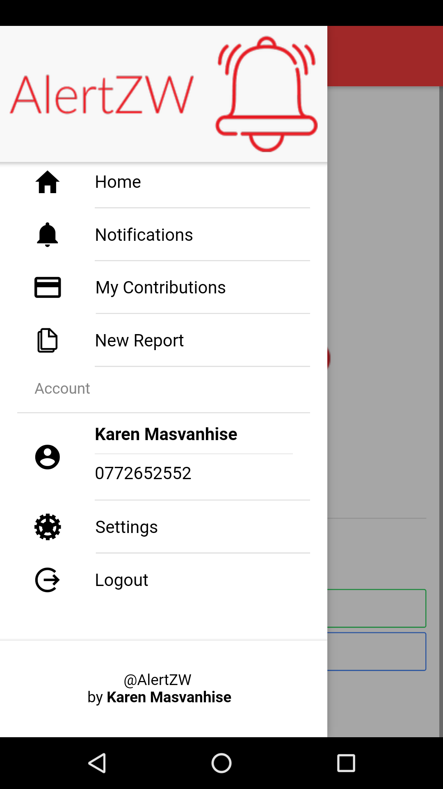
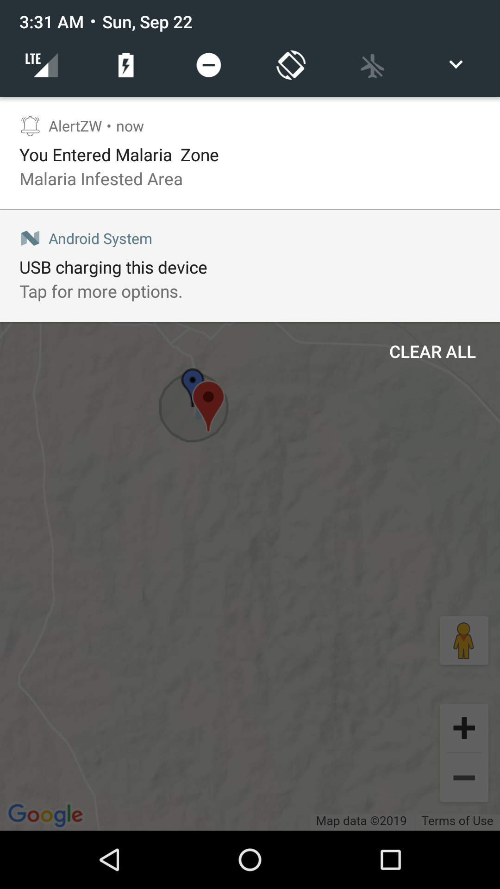
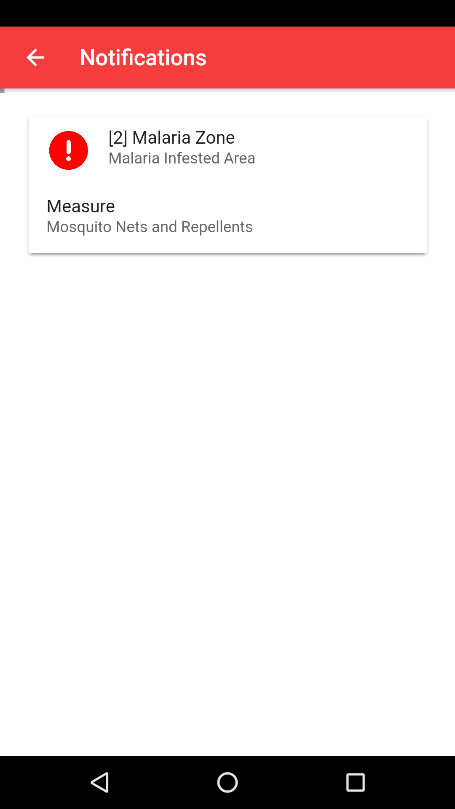
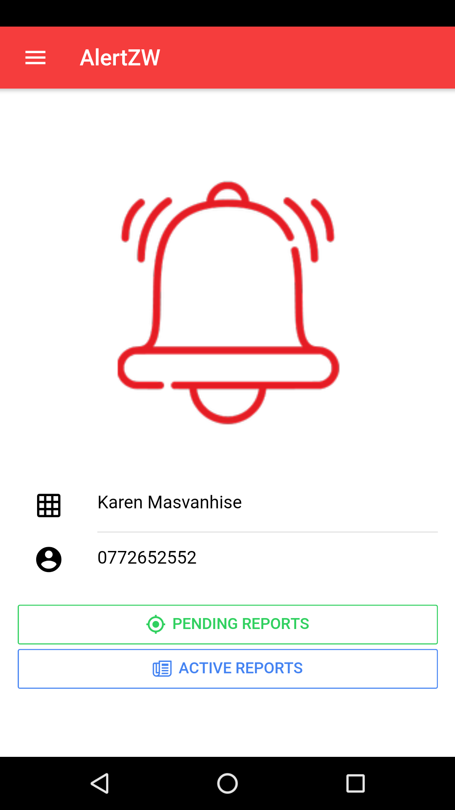
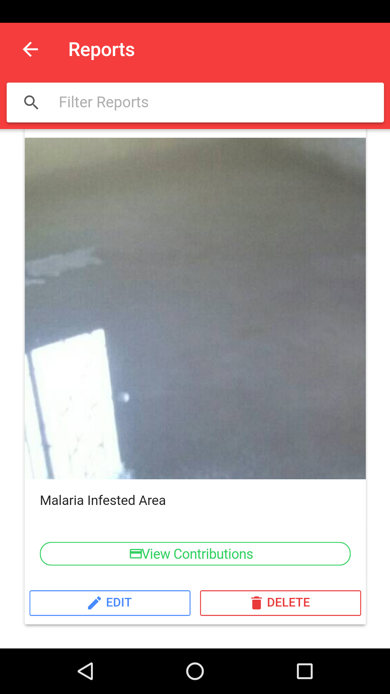
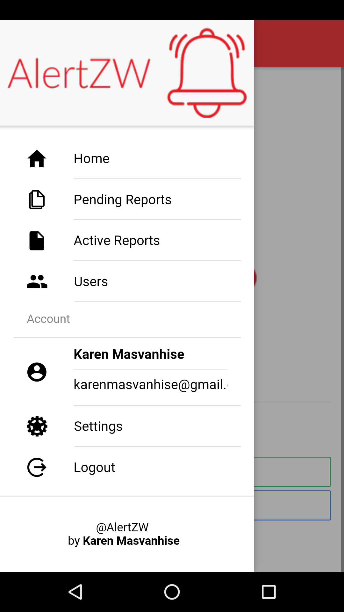
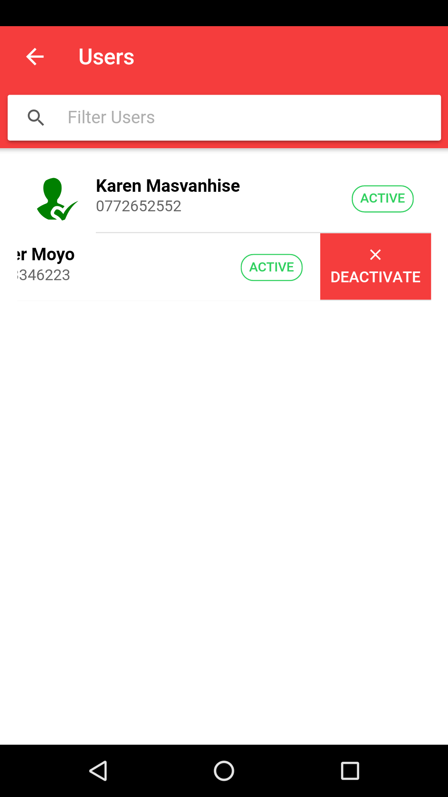

## Installations
### Prerequisites
1. PHP Server 7+
2. MySQL database server
3. NodeJS
4. Android SDKs

### Stages
1. npm i -g ionic
2. npm i -g cordova
3. Open project folder via console and run
npm i
4. extract the server_side_api.zip and add to web root
5. create database named hackathorn and import hackathon.sql
6. in project path run
ionic serve
7. when the login screen appears, slide from left to right and configure server ip e.g http://localhost/alertzw/
